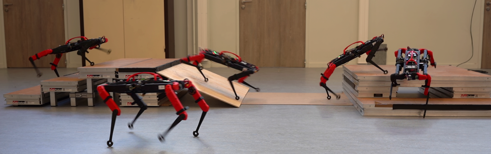

# Constraints As Terminations (CaT)

[Website](https://constraints-as-terminations.github.io) | [Technical Paper](https://arxiv.org/abs/2403.18765) | [Videos](https://www.youtube.com/watch?v=crWoYTb8QvU)



## About this repository

🚀 **New**: Check out the [IsaacLab](https://isaac-sim.github.io/IsaacLab/main/index.html) implementation on the [<code>IsaacLab</code>](https://github.com/Gepetto/constraints-as-terminations/tree/IsaacLab) branch!

This repository contains the code associated with the article **CaT: Constraints as Terminations for Legged Locomotion Reinforcement Learning** by Elliot Chane-Sane\*, Pierre-Alexandre Leziart\*, Thomas Flayols, Olivier Stasse, Philippe Souères and Nicolas Mansard.

This paper has been accepted for the 2024 IEEE/RSJ International Conference on Intelligent Robots and Systems (IROS 2024).

This code relies on the high performance RL library [RL Games](https://github.com/Denys88/rl_games) and a reinforcement learning wrapper for the NVIDIA Isaac Gym simulator provided by [IsaacGymEnvs](https://github.com/NVIDIA-Omniverse/IsaacGymEnvs.git).

We lightly modified both RL Games and IsaacGymEnvs to integrate our method in a minimal way, feel free to check `cat_common.py`, `cat_experience.py` and `isaacgymenvs_make.py` in the `utils` directory.

In `utils/constraint_manager.py`, we provide a `ConstraintManager` class to easily implement CaT:
```python
cstr_manager = ConstraintManager()

# Add all constraints
cstr_manager.add("torque", cstr_torque, max_p=0.1) # Add a soft constraint
cstr_manager.add("base_contact", cstr_base_contact, max_p=1.0) # Add a hard constraint

# Get the reward termination probabilities
cstr_delta = cstr_manager.get_probs()

# Rescale the rewards and rewrite the termination values
rewards *= (1.0 - cstr_delta)
dones = cstr_delta
```

## Installation

Download the Isaac Gym Preview 4 release from the [Isaac Gym website](https://developer.nvidia.com/isaac-gym), then
follow the installation instructions in the documentation. You can use the conda environment provided by `create_conda_env_rlgpu.sh` 
or manually install Isaac in a virtual Python environment.

**Virtual environment:** as binaries for Isaac Gym Preview 4 have been compiled a few years ago, precompiled bindings are only provided for Python 3.6, 3.7 and 3.8 so you might encounter issues trying to use them with newer Python versions. On a recent system we recommand to use Python 3.8.16 through [pyenv](https://github.com/pyenv/pyenv) which will allow you to install 3.8.16 without messing with your main Python installation. You can then create a `.python-version` file in your work directory, in which you just write `3.8.16`. If you type `python` in a terminal when placed in this directory, it should now use pyenv's Python 3.8.16 automatically. Finally, you can create a [virtual environment](https://docs.python.org/3/library/venv.html) for your Python 3.8.16 (that we call `venv`).

```bash
python3 -m pip install virtualenv
python3 -m venv venv
source venv/bin/activate
```

If you chose to use a virtual environment, you can install Isaac Gym with:

```bash
cd isaacgym/python/
python3 -m pip install -e .
```

Ensure that Isaac Gym works on your system by running one of the examples from the `python/examples` 
directory, like `joint_monkey.py` or `1080_balls_of_solitude.py`. Follow troubleshooting steps described
in the Isaac Gym Preview 4 install instructions if you have any trouble running the samples.

Once Isaac Gym is installed and samples work within your current python environment, install the [RL games repository](https://github.com/Denys88/rl_games) that contains a PPO implementation in Pytorch.

```bash
git clone https://github.com/Denys88/rl_games.git
python3 -m pip install -e .
```

Once RL Games is installed, install the [Isaac Gym Benchmark Environments](https://github.com/NVIDIA-Omniverse/IsaacGymEnvs) that contains environments and utils to run reinforcement learning in Isaac Gym, relying on RL Games.

```bash
git clone https://github.com/NVIDIA-Omniverse/IsaacGymEnvs.git
python3 -m pip install -e .
```

You will likely need to install Ray as it is not included in the requirements:
```bash
python3 -m pip install ray
```

In the following, if you encounter an error `AttributeError: module 'numpy' has no attribute 'int'.`, you can manually patch the problematic package.
```bash
nano venv/lib/python3.8/site-packages/networkx/readwrite/graphml.py
```

Look for `# prepend so that python types are created upon read (last entry wins)` and replace `(np.int, "int")` by `(np.int_, "int")`

To check your installation, while inside `/IsaacGymEnvs/isaacgymenvs`, you can run a basic example like the Cartpole training:

```bash
python3 train.py task=Cartpole headless=True
```

And check the result with:

```bash
python3 train.py task=Cartpole checkpoint=runs/Cartpole/nn/Cartpole.pth test=True num_envs=32
```

Check [IsaacGymEnvs' README](https://github.com/NVIDIA-Omniverse/IsaacGymEnvs/blob/main/README.md) for more information about the available parameters.

## Running CaT

Install the texttable module for monitoring purpose:

```bash
python3 -m pip install texttable
```

Place yourself in `/constraint-as-terminations` and launch a basic training setup on flat ground:

```bash
python3 train.py task=SoloTerrain  headless=True
```

If everything goes well, you will see monitoring statistics in the terminal as the training progresses. At the end, you can check the result with:

```bash
python3 train.py task=SoloTerrain num_envs=1 test=True task.env.enableDebugVis=True task.env.onlyForwards=True checkpoint=runs/SoloTerrain_xx-xx-xx-xx/nn/SoloTerrain.pth
```

## Citing

Please cite this work as:

```
@inproceedings{chane2024cat,
      title={CaT: Constraints as Terminations for Legged Locomotion Reinforcement Learning},
      author={Elliot Chane-Sane and Pierre-Alexandre Leziart and Thomas Flayols and Olivier Stasse and Philippe Sou{\`e}res and Nicolas Mansard},
      booktitle={IEEE/RSJ International Conference on Intelligent Robots and Systems (IROS)},
      year={2024}
}
```
